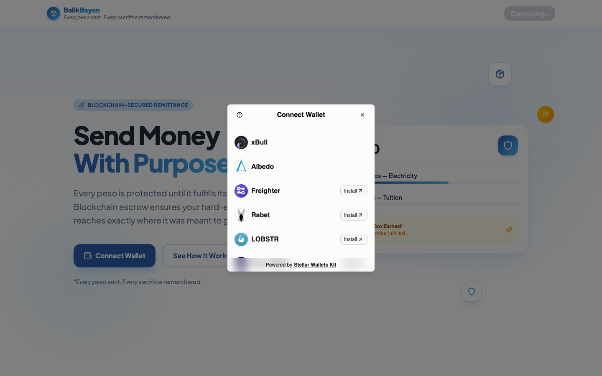
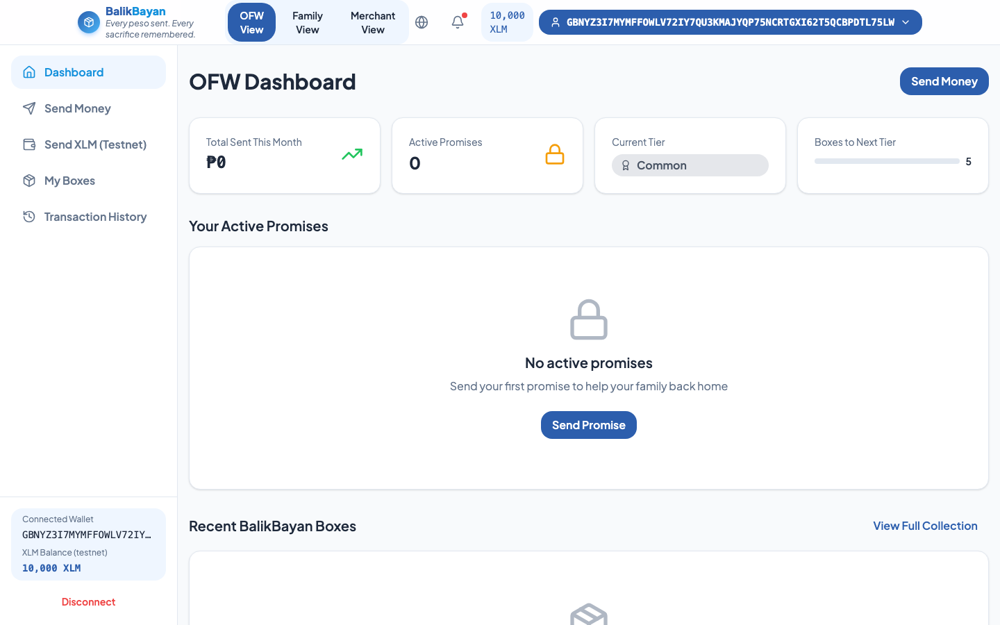
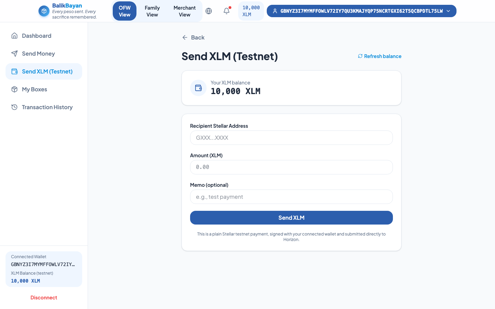
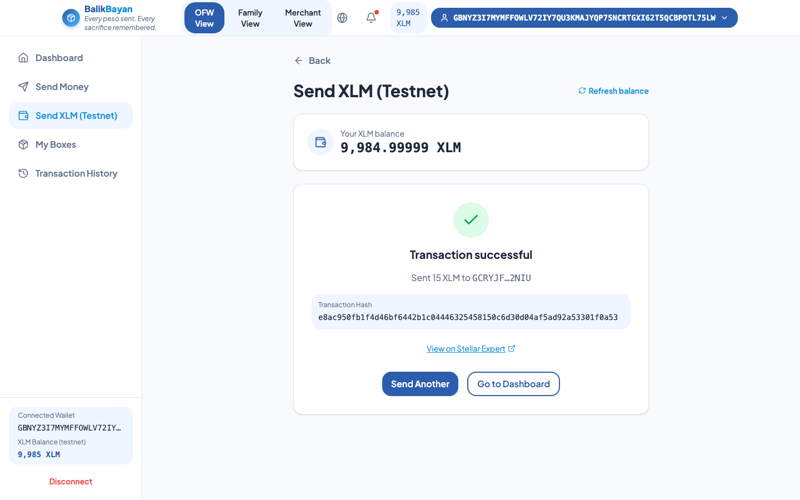
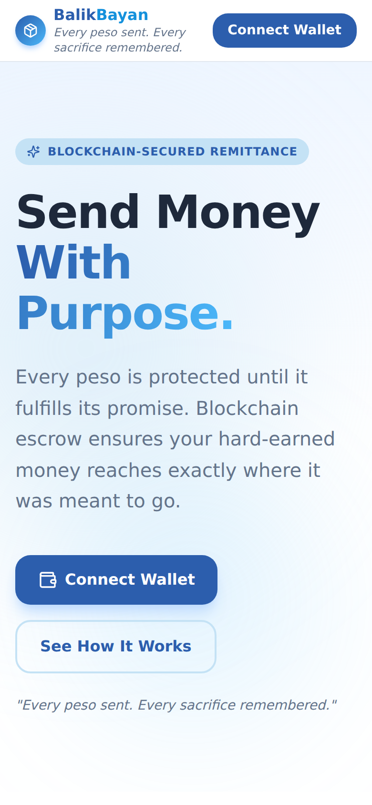
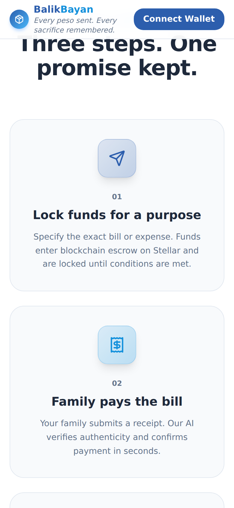
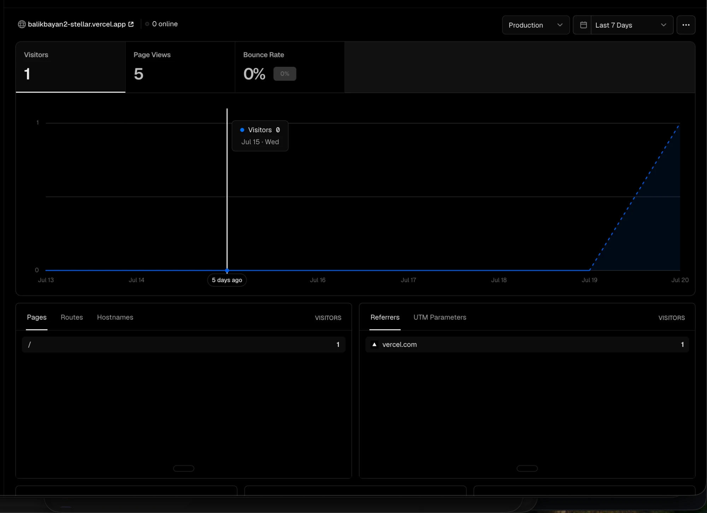

# BalikBayan
OFW conditional remittance and NFT legacy platform, built on Stellar.

Built by Lito Cruz.

**Live Demo:** [balikbayan2-stellar.vercel.app](https://balikbayan2-stellar.vercel.app)
**Demo Video:** [youtu.be/QHlMQDY7RLo](https://youtu.be/QHlMQDY7RLo?si=HLTIdWhFtL8n35Nx)
**Pitch Deck:** [canva.link/49tqe3zkf5p29nn](https://canva.link/49tqe3zkf5p29nn)

## Problem
A Filipino OFW working in Riyadh sends PHP 20,000 home every month for tuition, electricity, and medicine. Once the money hits the family's GCash — he loses all control. He has no way to ensure funds reach their intended purpose, no tamper-proof record of five years of consistent remittances to show banks or PAG-IBIG, and no rewards for being one of the 10 million OFWs collectively sending PHP 1.6 trillion home every year — nearly 9% of Philippine GDP. Every sacrifice is invisible.

## Solution
BalikBayan lets the OFW lock USDC in a Soroban smart contract escrow tagged to a specific bill — tuition, Meralco, Maynilad, PLDT, hospital, rent, or groceries. Funds are held on-chain and released only when the family submits verified proof of payment, checked by an AI layer powered by the Anthropic API. Every fulfilled promise automatically mints a collectible BalikBayan Box NFT to the OFW's wallet — a permanent, tamper-proof record of sacrifice. As boxes accumulate, the OFW advances through tiers (Common → Silver → Gold → Diamond → Legend) that unlock real merchant discounts for the family back home. Settlement happens in under 5 seconds with fees under PHP 1.

## Demo Flow (2 minutes)
1. Connect a Stellar wallet (testnet) as OFW — Freighter, xBull, Albedo, Rabet, LOBSTR, or Hana
2. Enter family's Stellar wallet address and bill details (e.g. Meralco, PHP 2,200)
3. Submit — contract locks USDC on-chain, Promise NFT mints to OFW wallet
4. Switch to family wallet — submit receipt photo as proof
5. AI verifies receipt — USDC releases to family wallet instantly
6. BalikBayan Box NFT mints — tier updates in OFW dashboard

## Wallet Connection & Testnet Transaction

Multi-wallet connect (via [Stellar Wallets Kit](https://stellarwalletskit.dev/)), live XLM balance, and a plain signed testnet transaction — end to end, verified on [Stellar Expert](https://stellar.expert/explorer/testnet).

**Wallet options available:**


**Wallet connected state:**


**Balance displayed:**


**Successful testnet transaction, with the result and transaction hash shown to the user:**


This flow ([SendXlm.tsx](frontend/src/app/pages/SendXlm.tsx)) is a plain `Operation.payment` — separate from the USDC escrow flow below — built specifically to demonstrate wallet connect, balance fetch, and a signed/submitted XLM transfer on Stellar testnet.

## 1. OFW POV (sender)


## 2. Family POV (receiver)


## 3. OFW POV (paid)


## 4. Mobile Responsive Design
The app is fully responsive down to a 390px viewport (iPhone 13), built with Tailwind's responsive breakpoints and served as an installable PWA.




## 5. Analytics & Monitoring
BalikBayan ships with [Vercel Analytics](https://vercel.com/docs/analytics) and [Speed Insights](https://vercel.com/docs/speed-insights) wired directly into the app (`App.tsx`), tracking real user page views, web vitals, and performance in production.



## Architecture
```
Browser (React + Vite + TypeScript)
  |-- Stellar Wallets Kit         (multi-wallet: Freighter, xBull, Albedo, Rabet, LOBSTR, Hana)
  |-- @stellar/stellar-sdk        (transaction building, RPC)
  |-- Anthropic API               (AI receipt verification via Claude)
  |-- Soroban RPC                 (on-chain reads and writes)

Stellar Testnet
  |-- BalikBayan Soroban Contract (escrow + NFT box minting logic)
  |-- USDC Token Contract         (SEP-41 token, Circle testnet)
```
No backend server. All escrow and NFT state lives on-chain. The Anthropic API is called from a Vercel serverless function to verify receipt photos before releasing funds.

## Project Structure
```
balikbayan2_stellar/
├── contract/
│   └── contracts/
│       └── hello-world/
│           ├── src/
│           │   ├── lib.rs          # Soroban escrow + NFT contract
│           │   └── test.rs         # Contract tests
│           └── Cargo.toml
├── frontend/
│   ├── api/
│   │   └── verify-receipt.ts       # Vercel serverless — Anthropic receipt check
│   ├── src/
│   │   └── app/
│   │       ├── context/
│   │       │   └── AppContext.tsx  # Global state, wallet, escrow actions
│   │       ├── pages/              # OFWDashboard, FamilyDashboard, SendMoneyWizard
│   │       ├── components/         # NFTBoxCard, TierBadge, BillTypeIcon, etc.
│   │       └── utils/
│   │           ├── contractService.ts  # Contract invocations
│   │           └── sorobanConfig.ts    # RPC + contract IDs
│   ├── vercel.json
│   ├── .env.example
│   └── package.json
└── README.md
```

## Stellar Features Used

| Feature | Usage |
|---|---|
| Soroban smart contracts | Escrow logic — lock, release, dispute, refund + NFT box minting |
| USDC on Stellar | Stablecoin settlement, no XLM volatility for OFW remittances |
| Stellar SDK | Transaction building, address validation, RPC queries |
| Stellar Wallets Kit | Multi-wallet connect and signing (Freighter, xBull, Albedo, Rabet, LOBSTR, Hana) for OFW and family |
| Soroban RPC | Simulate and submit transactions, read on-chain escrow state; event polling for real-time state sync |

## Smart Contract

Deployed on Stellar testnet:

```
CDTZLW3TJCJDFJYJST7W74HSI5T57O5WW7XYMTRRWJIGRQSG4U5PMXLP
```

> Explorer: [https://stellar.expert/explorer/testnet/contract/CDTZLW3TJCJDFJYJST7W74HSI5T57O5WW7XYMTRRWJIGRQSG4U5PMXLP](https://stellar.expert/explorer/testnet/contract/CDTZLW3TJCJDFJYJST7W74HSI5T57O5WW7XYMTRRWJIGRQSG4U5PMXLP)


### Contract Functions

| Function | Caller | Description |
|---|---|---|
| `create_escrow(ofw, family, token, amount, bill_type, deadline)` | OFW | Locks USDC in escrow, returns escrow ID |
| `confirm_payment(escrow_id)` | Family | Releases USDC to family wallet, mints BalikBayan Box NFT |
| `claim_refund(escrow_id)` | OFW | Returns USDC to OFW after deadline expires |
| `raise_dispute(escrow_id, caller)` | OFW or Family | Freezes escrow for arbitration |
| `get_escrow(escrow_id)` | Anyone | Read-only escrow state |
| `get_box_count(ofw)` | Anyone | Total NFT boxes minted for an OFW |
| `get_box(ofw, box_number)` | Anyone | Read individual BalikBayan Box metadata |
| `get_tier(ofw)` | Anyone | OFW tier based on box count |

### Escrow Status Lifecycle
```
Active --> Fulfilled  (family calls confirm_payment → NFT mints)
       --> Expired    (OFW calls claim_refund after deadline)
       --> Disputed   (either party calls raise_dispute)
```

### NFT Tier System

| Tier | Boxes Required |
|---|---|
| Common | 0–4 |
| Silver | 5–14 |
| Gold | 15–29 |
| Diamond | 30–49 |
| Legend | 50+ |

## Prerequisites

**For the smart contract:**
- Rust (latest stable)
- Soroban CLI v25+
- Stellar testnet account funded via Friendbot

**For the frontend:**
- Node.js 18+
- A Stellar wallet set to Testnet — Freighter, xBull, Albedo, Rabet, LOBSTR, or Hana
- Testnet XLM (for gas) and testnet USDC

## Setup

### Smart Contract
```bash
# Build
soroban contract build

# Test
cargo test

# Deploy to testnet
soroban keys generate --global deployer --network testnet
soroban contract deploy \
  --wasm target/wasm32-unknown-unknown/release/hello_world.wasm \
  --source deployer \
  --network testnet
```

### Frontend
```bash
cd frontend
npm install
npm run dev
```

The app runs at http://localhost:5173.

**Environment variables (`.env`):**
```
VITE_SOROBAN_RPC_URL=https://soroban-testnet.stellar.org
VITE_HORIZON_URL=https://horizon-testnet.stellar.org
VITE_CONTRACT_ID=<deployed contract ID>
VITE_TOKEN_CONTRACT_ID=CBIELTK6YBZJU5UP2WWQEUCYKLPU6AUNZ2BQ4WWFEIE3USCIHMXQDAMA
ANTHROPIC_API_KEY=<your Anthropic API key>
```

## Testing & CI/CD

GitHub Actions ([.github/workflows/ci.yml](.github/workflows/ci.yml)) runs on every push and pull request to `main`:

| Job | Steps |
|---|---|
| **Frontend** | `npm ci` → typecheck (`tsc --noEmit`) → test (Vitest) → build (`vite build`) |
| **Contract** | `cargo test --workspace` |

**Test coverage:**
- Frontend — 17 passing tests (Vitest + React Testing Library): wallet-error classification (`errors.test.ts`), PHP↔XLM conversion math (`tokenMath.test.ts`), and component behavior (`Button.test.tsx`)
- Contract — 5 passing tests (`contract/contracts/hello-world/src/test.rs`): escrow creation, refund after deadline, dispute raising, payment confirmation + NFT minting, tier progression

Run locally:
```bash
cd frontend && npm test        # frontend
cd contract && cargo test      # contract
```

## Sample CLI Invocations

```bash
# Create escrow: OFW locks USDC for family, tagged as tuition
soroban contract invoke \
  --id CDTZLW3TJCJDFJYJST7W74HSI5T57O5WW7XYMTRRWJIGRQSG4U5PMXLP \
  --source ofw \
  --network testnet \
  -- create_escrow \
  --ofw <OFW_ADDRESS> \
  --family <FAMILY_ADDRESS> \
  --token CBIELTK6YBZJU5UP2WWQEUCYKLPU6AUNZ2BQ4WWFEIE3USCIHMXQDAMA \
  --amount 357142857 \
  --bill_type '{"Tuition": []}' \
  --deadline 1717200000

# Family confirms payment (releases USDC + mints NFT box)
soroban contract invoke \
  --id CDTZLW3TJCJDFJYJST7W74HSI5T57O5WW7XYMTRRWJIGRQSG4U5PMXLP \
  --source family \
  --network testnet \
  -- confirm_payment \
  --escrow_id 1

# Check escrow state
soroban contract invoke \
  --id CDTZLW3TJCJDFJYJST7W74HSI5T57O5WW7XYMTRRWJIGRQSG4U5PMXLP \
  --network testnet \
  -- get_escrow \
  --escrow_id 1

# Check OFW tier
soroban contract invoke \
  --id CDTZLW3TJCJDFJYJST7W74HSI5T57O5WW7XYMTRRWJIGRQSG4U5PMXLP \
  --network testnet \
  -- get_tier \
  --ofw <OFW_ADDRESS>
```

## Target Users
Filipino OFWs (10 million strong) sending PHP 1.6 trillion home annually — working in Saudi Arabia, UAE, Hong Kong, Singapore, and beyond. They earn PHP 40,000–120,000/month abroad and send 60–80% home. They have no way to earmark funds, no proof of their remittance history for loan applications, and receive zero recognition for years of sacrifice. BalikBayan gives them control, proof, and rewards — all in one wallet.

## User Testing & Feedback

### Testers

52 real testers connected a Stellar wallet and used BalikBayan during our testing round (collected via Google Form, self-reported wallet addresses — see Feedback Collection below for the response export).

| Name | Wallet Address |
|---|---|
| Cruz, Lito | `GD4ZG3Q7WTG55AM5OCRVGJIHJPYRRBJ4UYSM37H7FF27OILGUTAX46EM` |
| Ethan Dreiz Baltazar | `CAX4JXJRLGWAGG2PNC36CNJXM5KVM4L5WNK6ID6WNRQHCEIZLQVCJ2YD` |
| Maria Santos | `GCCALVKA5CK3KBCXJBBVKP56R2IOPW7ZUFUVM2BCSJHMBZZMJ55KR4LU` |
| Jose Reyes | `GA2AG5RVFWM4ATBYZ56SJYGJRQJJI5WECW66RPJXXRWM7NS2GXZDY6CQ` |
| Ana Cruz | `GCWIH4I5VU3LLNMDNBEESNWEMUD34C6HAWGD77YT36QE3Q3LJG5RPAGG` |
| Carlo Bautista | `GBDM6GWYI2M3LQ5ZSNTYFS5TTFO2LVRDKGGKQWAINL3S265KO74EDYQR` |
| Liza Garcia | `GBJRPV2JSPA64MCZDDTPDLMXBFWX2WRQRRBAOIYVMZORPBPGHPNPEFJQ` |
| Miguel Torres | `GD7763Y3DNFEZ4QEQXOAZNXFNHFWVIEYRJMF3JMHHKE527VKUA4YYRYV` |
| Rosa Flores | `GBSD7O6M7ZITM34GVXLK63X6KMJPYGRTVPD7H3UWCURKA2EQJHAEPP5Q` |
| Antonio Ramos | `GAIJQDHYHPSOWKYO3YH3ENJFN77TN3URDZQ2QGIUOSS7IJFCANO4LU3R` |
| Carmen Villanueva | `GADTHSKW33BUYXXRQFEGL7ZDPDSNKXTKKYGLTXWO5VDSOE7L37E7VP44` |
| Pedro Mendoza | `GDLBRPW6YGJEFNMRDIPEJVBVQ7QBKTDRY5ASJ3UXVMW7ZZHZS6QMOQNX` |
| Elena Aquino | `GDIT77PG5Q5XHETQPGHVVETSSFERE3X62G4YJK74XKBTHT73RR6QZAF2` |
| Ramon Castillo | `GDOVOCJOJ3FCHHQAMV6LW445VRHWAAKRSEG5AF53SXWJ4MPSL6AIOWCV` |
| Sofia Del Rosario | `GBVBSCHGWDKN5IP3EN3FSOH7WJB7QIFXGS6G3NW74Z4A24VQWPRC4MUW` |
| Gabriel Manalo | `GAGTLESEBE2KQJE6BH7XYG2B5M6ORPXOJCGPGV6SPLJEX6D5RZFJHHMQ` |
| Teresa Navarro | `GC2SDGOQ7NMGLZJCM7FO4HDKJYFHUMR2D37U6KWHUNP2DFDTGJDFOY7C` |
| Francisco Domingo | `GBEQVB4ED5UVXTGZ7ITHAZNWNKN6PJNHYW6LO4PXZUSZEFGGMNYZGLJC` |
| Isabel Pascual | `GCCMUO6KXUBK2BTCIRDJEXVKPGTEF4GUZXM2Y47SAPOSAQWI7YUAWS66` |
| Rafael Salazar | `GAHGPWEPMAGYXXJJIF345MAU6Y5MI3YFJ6OADY2EAD7P43JHIO23D466` |
| Luz Fernandez | `GAYYALGRRSEJXNKBY223AWRB6MDFG44DWLUX6INAZJTMH3BIBSXMEZHI` |
| Andres Marquez | `GB6PRGHQGVGLPKCTZ3YGTGMZ2PEDFFVNVPXCSYMKK5LW3SYCJOD23IP3` |
| Cristina Ocampo | `GAZQG4YGEAXFRCWDZS2JXK3E477BKROUPVJAS55LE7OJUEB46TA7OLNE` |
| Eduardo Tolentino | `GD7Q2EXRZRKX5O3KNJLS4ZEYN7XXR5FELBCGZ5DEXXRVRRDP4PUN2LNL` |
| Beatriz Rivera | `GBVAO76G3YWPMRWHSYEOXUMP53PNVN4UGEFNW4XPFISUTEAY5YIFHJBT` |
| Manuel Espiritu | `GBYACIOBL6H625QT6TO2KHDFGL26UJ4AJY5UM6AZGHKGCA34L6DXMSBH` |
| Victoria Lopez | `GDY2JE2BTZ52CGVV7LF5Z6A2FKXKN5CBYWDHWFESOMYUJKJT2JZR4H7S` |
| Fernando Gonzales | `GDRNGGVU5LJLRHUKOYVXRETGJKHTQVF5323ZZCSYNVGITKEAMX7NVIVC` |
| Angelica Ramirez | `GAKTDQA6C5DZZBFHSI37OKUEKS5ZTMLM7PKII4YMMBASYEQQ2FB3KCR2` |
| Roberto Dizon | `GBADTNJGR6S2UQDBFNJ732SJFSC7PBIA3HUZL5HSPPUK4WNHNTXITFNG` |
| Patricia Valdez | `GBNKARXATYUOUTB6QLJPCLUFNBGV4FRH4WZBIVXOTWCP3P5P37Q52BSN` |
| Ricardo Custodio | `GD7MDGCTFG75JRGYUW7UH4AMMZK2CIIMRB56NHKXNN5CEDH6SKZ65CVR` |
| Gloria Morales | `GB65BQGLI32R2G7QCS4ITC6MAKP2SCWO3S4US5WN5VMFQZOEUSIVN5SO` |
| Alfredo Aguilar | `GBIJGV5NOTKVEAN5LDFMQ4RFXAFZ6FUFTY5R5WQT3DMQ75LPFVMLNWEL` |
| Josefina Herrera | `GDKZIHHPC336PR757TIXDNXTGR75MQCFLHUJQOBT6QTBXDICQBICB7VS` |
| Danilo Perez | `GBTVOUIT27UAWROUWY32JEATNKI42BWXWVPWSED34VQ5FRUOKNHUCPGW` |
| Remedios Santiago | `GC733DYST6PNQPCJ4DT4BKTQUL3ZLSMMMUD6WYQ5MY2H4J74VIUSZ5M2` |
| Arturo Panganiban | `GBGIRLKPOMYD3JVVNRNJTZEVDH4BH37T2SYESMWFDQU4DNJOBW76SHYZ` |
| Corazon Rosales | `GDR5H5A73UFR5HKI6AWMH776L4HLIHL5WRQ2KFMPUNLQD2MZAZ5RENBI` |
| Ernesto Villareal | `GAP3L4QUUHLSI4BG23AVTZXVAACWC6O5WLQJX6GYTE4DEN5TRR3QXIF6` |
| Milagros Cabrera | `GD2BLJH4P5NTGNDEUIDILEIDCYOTGCMBNKPFS4VIPHU6H3DJB6QC47RA` |
| Salvador Ignacio | `GCAO7JXWMYIWDS2YOTYMKXGY3VMEVX2TECLO2CNASFM46TWGOSNJYCBR` |
| Divina Baltazar | `GB4IAC52P6CYCYZ2RODNTQYDECKCOCIEZE2OIIE4AWOUPOVZUOU7CQ37` |
| Leonardo Guevarra | `GCWNR6WF37INFKSLIYEET7NEKIVMPF56FUY6LJ5FXALJWZAYYBCFUXCP` |
| Adoracion Lim | `GBPPHKH33KEOTVOI5DAYOYYREOOD4HEDTMF3QT753LKRYIYMQ7G2MXAO` |
| Bienvenido Castro | `GAUUTPIIBJ3IF5AWXY467ERQXK3UFG4ZZP7BLUH25OAXIUHT6ZF7WHQN` |
| Purificacion Uy | `GAYNIO777ONAKGMPCJ2HCFCDXBHTVTROTGGW6GVCUKGQUHCO3YM5PNIT` |
| Wilfredo Sarmiento | `GDCHD67J3CUBNT6AXSJN6CYNR2LQMNVROIWYGA5UKWHADDL4RWTXZROA` |
| Concepcion Molina | `GCJATR5RT2LQAYCC2BGSUMXWSLHMQJ53GWJY4EOM54BVWCZ5A5FR47EE` |
| Nestor Abad | `GAPTKJIJYUMH3O6F2NEJSABS25BN47XY6DBWVHTRASISE56XD5JQPY6W` |
| Perla Batungbakal | `GB6HHPZG3FW7NED2RX6WEKIW3ZTQN4BSC36OPRLW77IISWF2UHZUTX5F` |
| Renato Cortez | `GAFQI5IQ4QWDCIRQ554MRGW6AZKEN4YPMDK2YR2KO3SFY374GNSWJXXC` |

### Feedback Collection

We collected feedback from 54 testers via a [Google Form](https://forms.gle/hHq3cR8P2Ma2VDVFA) covering how they found BalikBayan, which features they used, an overall experience rating, what they liked, and what to improve.

Feedback Form: [forms.gle/hHq3cR8P2Ma2VDVFA](https://forms.gle/hHq3cR8P2Ma2VDVFA)
Raw Responses: [Google Sheet](https://docs.google.com/spreadsheets/d/196_Zh_AjB0ohW9ajXkJ-ge-FyuBcLvCdKH84WbgIeLw/edit?usp=sharing)

**Summary:**
- **Average rating: 4.82 / 5** across 54 responses (42 gave 5/5, 9 gave 4/5, 3 incomplete)
- **How testers found us:** Social Media (16), Friend or Colleague (14), Hackathon / Event (12), Online Search (9)
- **Feature usage:** Send Money / Create Escrow (37), Transaction History (32), Family Dashboard / Confirm Payment (20), NFT Box Collection (17), Merchant Dashboard (9)

**What testers liked most:**
- "The escrow system makes remittances more secure and transparent." — Lito Cruz
- "The NFT reward idea makes sending money more engaging." — Ethan Dreiz Baltazar
- "Escrow gives confidence that funds are protected." — Jose Reyes
- "Sending remittances while earning NFTs is a unique idea." — Teresa Navarro
- "The escrow feature builds trust between sender and receiver." — Remedios Santiago

**What testers want improved:**
- Support for more Stellar wallets beyond Freighter (multiple testers)
- Smoother onboarding / a beginner's tutorial for first-time blockchain users
- Faster loading and better mobile responsiveness
- Push/email/SMS notifications for payment status changes
- More NFT box designs and collectible variety

### Planned Improvements (Based on User Feedback)

The most common requests above are shaping the near-term roadmap:

| Feedback theme | Planned change |
|---|---|
| "Add support for more wallets" (multiple testers) | ✅ Shipped — multi-wallet via Stellar Wallets Kit (Freighter, xBull, Albedo, Rabet, LOBSTR, Hana) |
| "Improve onboarding for new users" | Add an in-app first-time tutorial / wallet setup guide |
| "Improve loading speed on mobile devices" | Code-split the frontend bundle (the wallet kit's multi-wallet support grew it to ~2.6MB; needs `manualChunks`) |
| "Add push/email notifications for payment status" | Add status-change notifications for escrow lifecycle events |

## Why Stellar
No other chain gives sub-cent fees with native USDC support at the speed OFW remittances demand. Stellar's 3–5 second finality and sub-PHP-1 fees make this directly competitive against Remitly, Western Union, and GCash padala. The escrow contract is composable — the same pattern works for any conditional payment use case beyond remittances.
